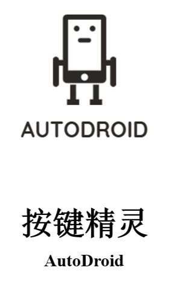
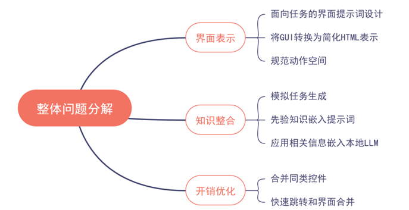
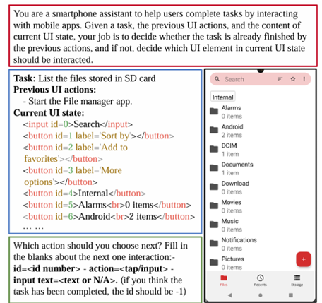

# AccessibilityService

AutoDroid是一款基于大语言模型（LLM）和无障碍服务技术的智能手机自动化助手，通过将APP的UI界面转化为HTML文本，并利用LLM推理能力，能够在任何应用上自动化执行任务，突破了传统智能助手依赖API和开发者适配的限制。其创新点包括离线生成APP的Memory表、快速跳转指令执行、隐私保护功能等，尤其关注残障人士的使用需求，提供便捷的语音输入和自动化操作。同时，AutoDroid通过将LLM部署到本地手机，确保了用户数据的隐私安全，不需要将信息上传至云端，满足了对隐私保护有高要求的用户需求。

图1 整体问题结构设计

依据图中的问题抽象，项目主要问题为界面表示、知识整合、开销优化。对问题进一步划分如图1所示。整体分为三个大模块，分别描述如下：

## 面向任务的界面提示词设计

界面提示词设计(UIPrompting)指的是用文字描述界面信息，并将该文字描述嵌入到对大模型请求的提示词中。界面提示词设计的目的是为大模型清楚明白地展示当前界面的一些文字性的或者结构性的内容，同时限制大模型的输出格式，以关注特定的反馈结果。接下来我们用图2表示整个界面提示词设计的过程。

## 基于探索的知识整合

基于探索的知识整合(Exploration-based Memory Injection)的目的在于为大语言模型提供和当前应用直接相关的信息，让大语言模型能够利用这些信息，理解当前应用的运行逻辑，得出更为有效的决策。在这一方面我们仍然注意到了以下几点困难：

1. 随机探索得到的界面转换关系图(UTG, UITransitionGraph)无法直接交由大模型进行处理；
2. 直接从界面跳转的自动化agent只能获取到随机探索过程中每一步的UI界面和采取的动作，和实际完成某个特定任务有很大区别；
3. 应用所具有的界面数和控件数非常多，如果一次性交给大模型，将超过大语言模型的token数限制。

为了解决上述问题，AutoDroid从随机生成的UTG中无监督生成任务；而这些生成的任务将作为参考，指导大语言模型如何完成真实的用户任务。

## 多粒度请求优化

在AutoDroid运行时，主要的开销来自于对大语言模型的请求。因此，降低每个任务的请求频次将有助于降低整个系统的开销。此外，在更细粒度的层面上，在每个提示词中删去不必要的部分，也会是相当有效的方法。

UI Prompting 具体过程：

图2 UI Prompting

## 界面设计

图3 AutoDroid 启动界面

